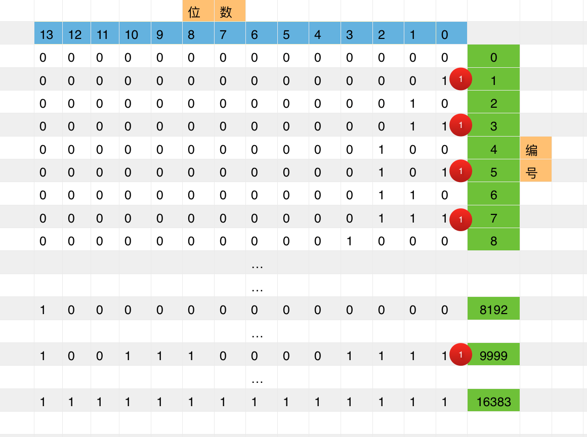
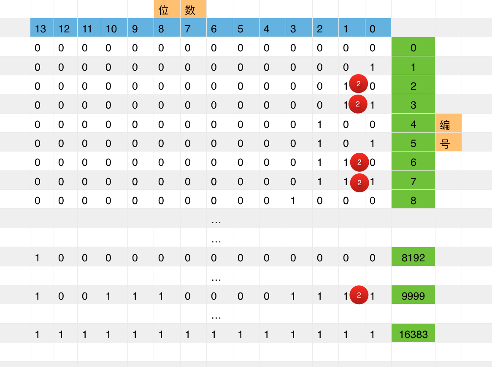
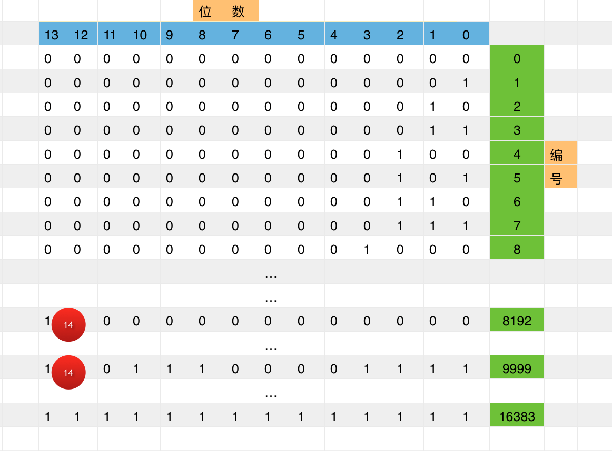
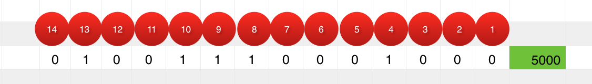

#### 2题：某品牌有10000桶牛奶，但因为工作人员不小心其中一桶混进去了毒素，现准备若干只小白鼠进行试验，已知毒素发作死亡需要一天时间，问最少需要多少只小白鼠并在一天内查出哪桶牛奶出现问题？  

题解1. by [@iHongRen]([https://github.com/iHongRen](https://github.com/iHongRen))

**首先要明确的是，一只小白鼠可以试验多桶牛奶。**

对这10000桶牛奶进行编号0...9999，对应的二进制为0x00000000000000...0x10011100001111（14位）。

- 让第1只小白鼠喝下编号为第（1，3，5，7，… ，9999）的牛奶，即二进制编号第0位值为1的牛奶。（红色圆代表小白鼠及其编号）

- 让第2只小白鼠喝下编号为第（2，3，6，7，...）的牛奶，即二进制编号第1位值为1的牛奶。

- …（3~13）

- 让第14只小白鼠喝下编号为第（8192，8193，8194，… ，9999）的牛奶，即二进制编号第13位值为1的牛奶。

一天后记录，小白鼠死亡记为1，活着记为0。最后得到一组14位的二进制数，即为毒牛奶的编号。

比如：

> 4号死了，即表示二进制编号第3位为1的牛奶可能有毒，
>
> 8号死了，即表示二进制编号第7位为1的牛奶可能有毒，
>
> 9号死了，即表示二进制编号第8位为1的牛奶可能有毒，
>
> 10号死了，即表示二进制编号第9位为1的牛奶可能有毒，
>
> 13号死了，即表示二进制编号第12位为1的牛奶可能有毒，

最终可以确定这个二进制 0x01001110001000 = 5000，也就是说编号为5000的桶就是毒奶。

*如果都没有死，那0编号的就是毒奶。*

**可能以上还是没有说清楚，请参考知乎：**

[有 1000 个一模一样的瓶子，其中有 999 瓶是普通的水，有一瓶是毒药。任何喝下毒药的生物都会在一星期之后死亡。现在，你只有 10 只小白鼠和一星期的时间，如何检验出哪个瓶子里有毒药？](https://www.zhihu.com/question/19676641)